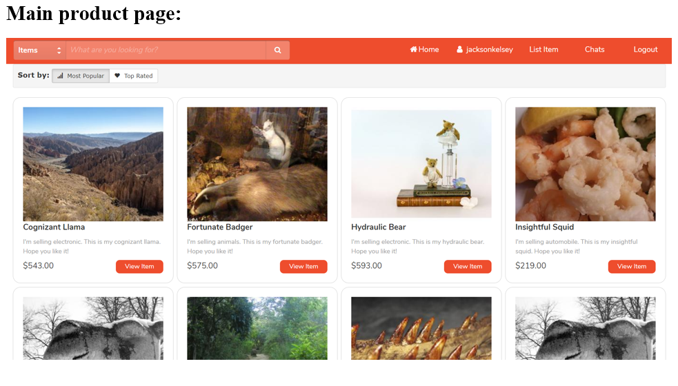
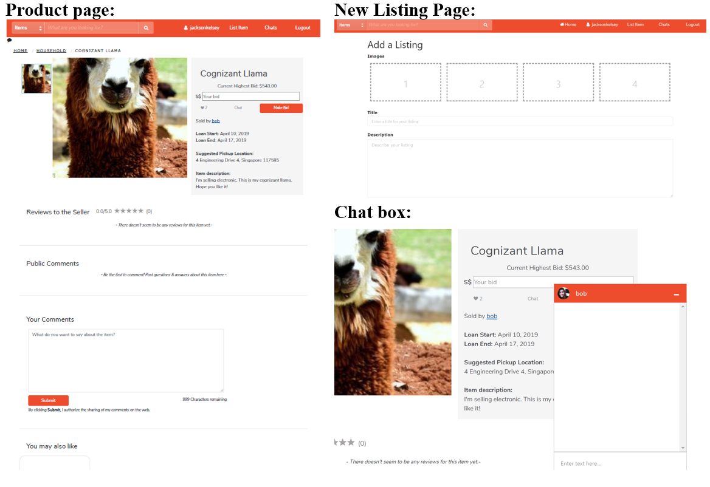
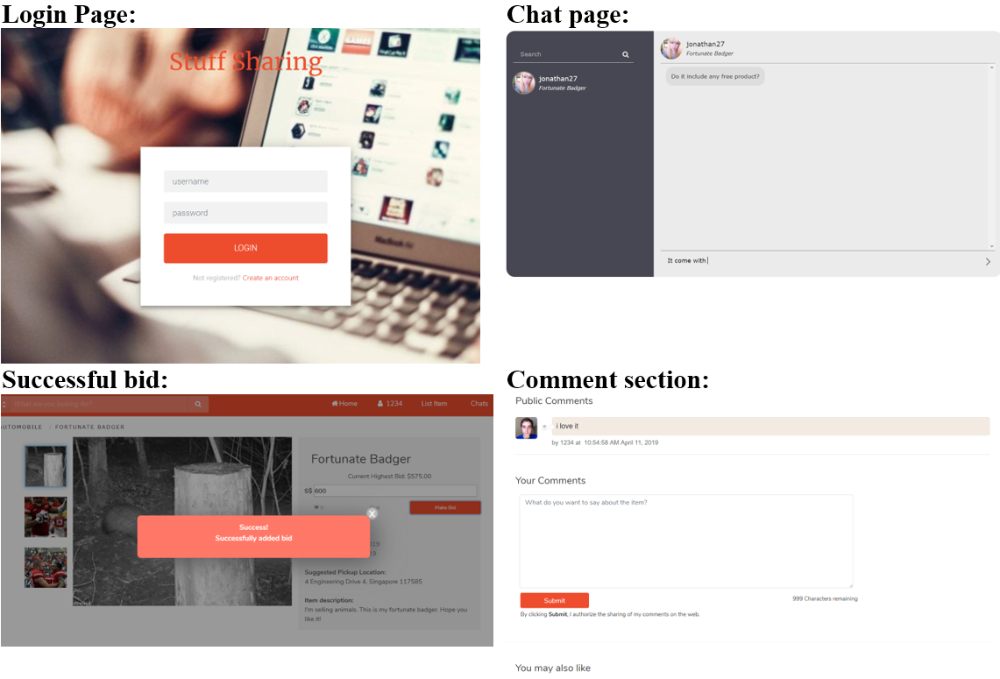

Travis: 

# Welcome to my stuff sharing website  
Offical Url: `https://cs2102postreg.herokuapp.com`

## Sample images

# Instruction on how to start localhost
run `npm install`  
run `npm start`  
Go to any internet browser, enter `http://localhost:3000/`

## Postregsql connection error
If you stuck at connection please ensure that your postreqsql is running   
Run start postreqsql  
Ensure that the correct user, host, database, password, port is used  

## Populating the database using PYTHON
To populate the database please execute the python file `main.py`  
run `cd datagenerator`  
run `py main.py`
